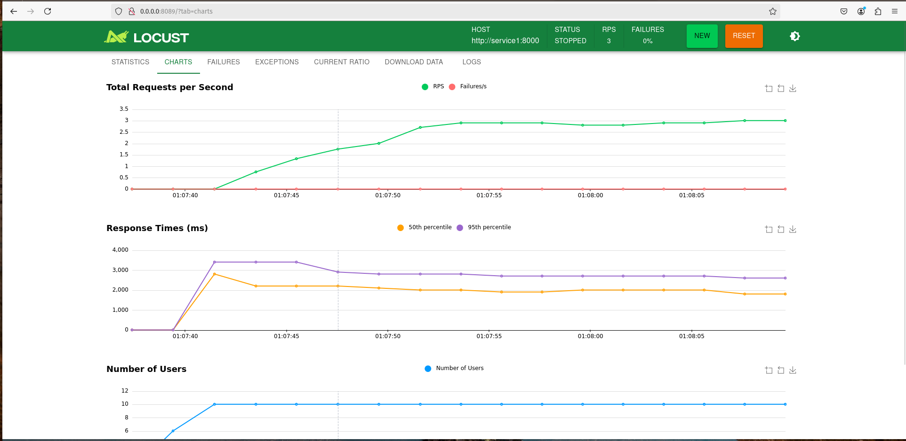

# Como configurar e rodar o projeto

Primeiramente, e necessario clonar o repo

git clone https://github.com/LipeLangoni/hotmart_desafio.git

Feito isso, certifique-se de criar o arquivo .env na raiz do projeto, e adicione a seguinte variavel de ambiente nele:

OPENAI_API_KEY="exemplo_de_chave"

Em seguida, o projeto esta pronto para ser executado com o comando:

sudo docker compose up --build

# Servicos

O projeto conta com os seguintes servicos:

- API para realizar perguntas a respeito dos dados contidos na pagina https://hotmart.com/pt-br/blog/como-funciona-hotmart
- API para resgatar os dados da pagina acima e persistir os dados enquanto vetores em um Chroma db.
- Playground para realizar testes caso seja de interesse
- Locust para realizar Load Tests via UI

# Service1

O primeiro servico se trata de uma api preparada para responder perguntas relacioandas a empresa hotmart, ele recebe a pergunta do usuario, calcula a similaridade da pergunta com vetores no Chroma gerado em startup pelo segundo servico, e retorna uma resposta elaborada pelo modelo gpt-4o-mini.

Para realizar uma requisicao nesta api, pode-se utilizar o seguinte comando:

curl -X POST "http://localhost:8000/chat" -H "Content-Type: application/json" -d '{"text": "como vender com hotmart?"}'

Alternativamente, pode-se utilizar o ambiente de playground que sera introduzido posteriormente.

# VectorDB

O segundo servico e a api responsavel por gerar o banco de dados que sera consumido pelo Service1. Na inicializacao dessa api, um startup event acionara uma funcao que realizar o webscrapping na pagina da hotmart e carrega o texto em documentos, separados por chunks. A estrategia de chunking adotada foi a divisao por topicos chave, embora outras abordagens e estudos tenham sido realizados no processo (Sera abordado mais a frente). A instancia do Chroma db gerada e entao perssistida na pasta data/, que e criada caso nao exista, e sera compartilhada como servico anterior atraves de um volume, para garantis que a primeira api tem acesso ao vectordb.

## Estrategias de Chunking

No intuito de encontrar o numero ideal do tamanho do chunk (chunk size), foram adotadas as seguintes estrategias:

### Grid Search Chunk

Foi utilizado o framework llama index para realizar um grid search no paramtro "chunk size" afim de encontrar o tamanho ideal. Para tal, foram utilizadas algumas metricas como tempo de resposta, Faithfulness tests e etc

### Topics Chunk

Uma abordagem um pouco mais intuitiva que se mostoru uma excelente opcao, foram separados os chunks realizando o split por "##", markdown que separa os topicos da pagina.

# Playground

O Playground e um microservico extra disponibilizado para que se tenha uma experiencia mais agradavel e intuitiva caso deseje. Basta acessar a Network URL gerada nos logs do container do servico 3 que pode ser encontrado apos executar o docker compose, ou entao com o comando: "sudo docker compose logs service3" caso tenha utilizado um comando alternativo para executar o compose.

## Locust

Por fim, assim como o Playground, este tambem e um servico extra que disponibiliza uma interface de usuario para realizar testes de carga na primeira api.

Basta acessar "http://0.0.0.0:8089" e configurar o numero de usuarios e outros parametros para iniciar a simulacao.

