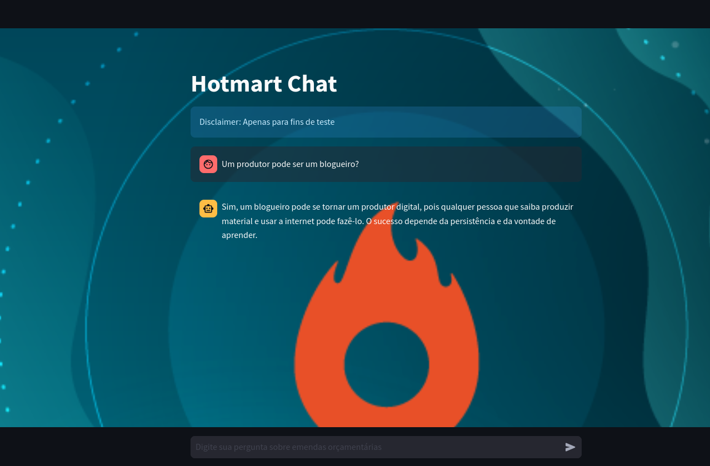

# Como configurar e rodar o projeto

Primeiramente, é necessário clonar o repositório:

```bash
git clone https://github.com/LipeLangoni/hotmart_desafio.git
```

Feito isso, certifique-se de criar o arquivo .env na raiz do projeto e adicione a seguinte variável de ambiente nele:

```bash
OPENAI_API_KEY="exemplo_de_chave"
```
O Conteúdo do .env será exportado como variável de ambiênte dentro dos containeres necessários, portanto, é de suma importância essa configuração para que a aplicação funcione adequadamente.

Em seguida, o projeto está pronto para ser executado com o comando:

```bash
sudo docker compose up --build
```
# Serviços

O projeto conta com os seguintes serviços:

- API para realizar perguntas sobre os dados contidos na página https://hotmart.com/pt-br/blog/como-funciona-hotmart
- API para resgatar os dados da página acima e persistir esses dados como vetores em um Chroma DB.
- Playground para realizar testes, caso seja de interesse.
- Locust para realizar testes de carga via UI.


# Rag API

O primeiro serviço se trata de uma API preparada para responder perguntas relacionadas à empresa Hotmart. Ela recebe a pergunta do usuário, calcula a similaridade da pergunta com vetores no Chroma, gerados na inicialização pelo segundo serviço, e retorna uma resposta elaborada pelo modelo GPT-4o-mini.

Para realizar uma requisição nesta API, pode-se utilizar o seguinte comando:

```bash
curl -X POST "http://localhost:8000/chat" -H "Content-Type: application/json" -d '{"text": "como vender com hotmart?"}'
```

Alternativamente, pode-se utilizar o ambiente de playground, que será introduzido posteriormente.

# VectorDB

O segundo serviço é a API responsável por gerar o banco de dados que será consumido pelo Service1. Na inicialização dessa API, um evento de startup acionará uma função que realiza o web scraping na página da Hotmart e carrega o texto em documentos, separados em chunks. A estratégia de chunking adotada foi a divisão por tópicos-chave, embora outras abordagens e estudos tenham sido realizados no processo (será abordado mais à frente). A instância do Chroma DB gerada é, então, persistida na pasta data/, que é criada caso não exista, e será compartilhada com o serviço anterior através de um volume, para garantir que a primeira API tenha acesso ao vectordb. Após a inicialização, ainda é possível realizar uma requisição na api para que ela gere novamente o vector db, se for o caso:

```bash
curl "http://localhost:8080/generate_vectorste"
```

## Estrategias de Chunking

No intuito de encontrar o número ideal para o tamanho do chunk (chunk size), foram adotadas as seguintes estratégias:

### Grid Search Chunk

Foi utilizado o framework LlamaIndex para realizar um grid search no parâmetro "chunk size" a fim de encontrar o tamanho ideal. Para isso, foram utilizadas algumas métricas, como tempo de resposta, testes de fidelidade, entre outros.

### Topics Chunking

Uma abordagem um pouco mais intuitiva, que se mostrou uma excelente opção, foi separar os chunks realizando o split por "##", que é o markdown que separa os tópicos da página.

# Unit Test

Os testes de unidade foram focados em testar todas as funções que estão sendo utilizadas do serviço 2 para gerar o banco vetorial uma vez que este processo pode ser delicado. Foi utilizada a biblioteca pytest para tal.


# Playground

O Playground é um microserviço extra disponibilizado para proporcionar uma experiência mais agradável e intuitiva, caso deseje. Basta acessar a URL da rede gerada nos logs do container do serviço 3, que pode ser encontrada após executar o Docker Compose, ou então com o comando: "sudo docker compose logs service3", caso tenha utilizado um comando alternativo para executar o Compose.



Url gerada para acessar o serviço:


## Locust

Por fim, assim como o Playground, este também é um serviço extra que disponibiliza uma interface de usuário para realizar testes de carga na primeira API.

Basta acessar "http://0.0.0.0:8089" e configurar o número de usuários e outros parâmetros para iniciar a simulação.


